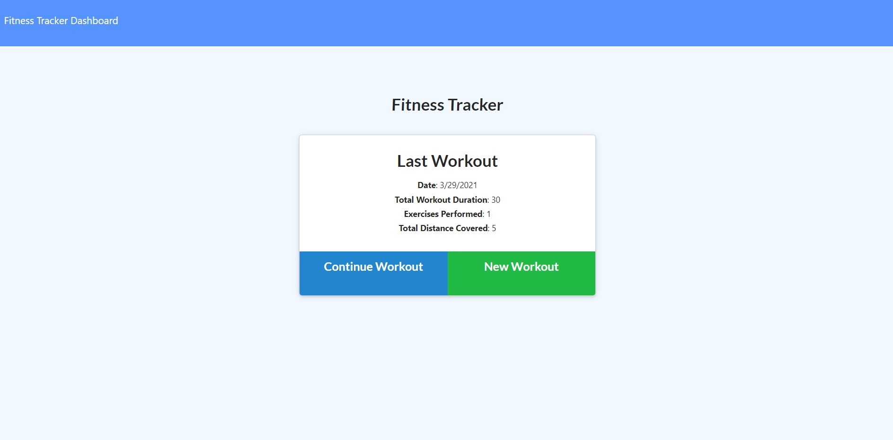
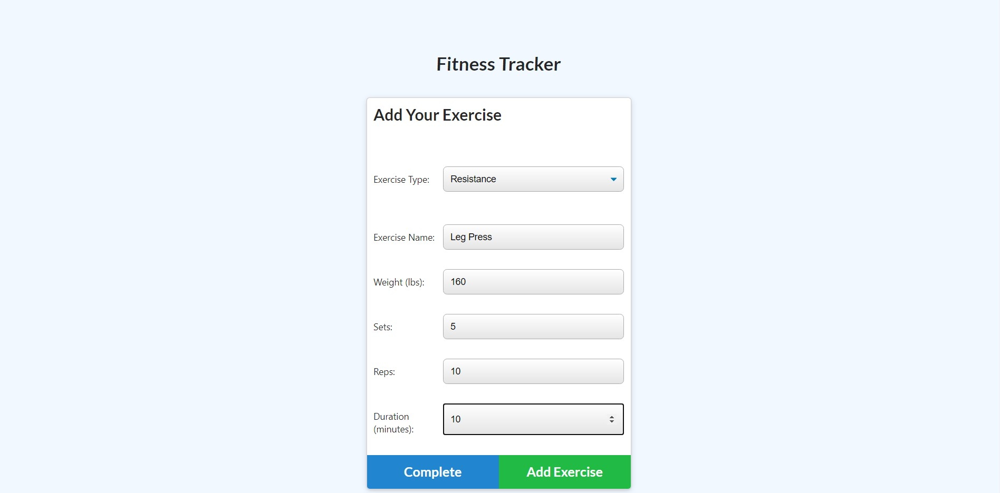
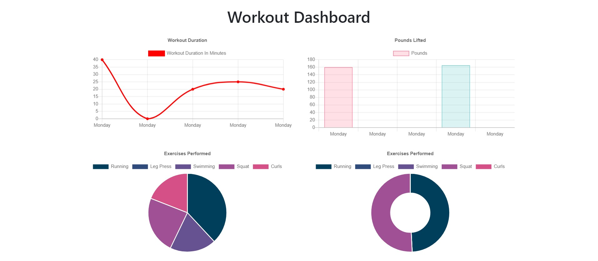

# Workout-Tracker

    
## Description
    
This application allows a user to keep track of their daily workouts. On your home screen, your last workout's information will be displayed (if you've added a workout before). To add a workout, a you click "New Workout", then enters their workout's information. A workout is able to have multiple exercises, so after entering the first exercise's info, click "Add Exercise" and you'll be redirected to the "Add Your Exercise" screen where you can add the next exercise. Once you've entered your full workout, click "Complete". Your Dashboard will give you the duration and weight statistics of all of your past week's workouts.

This application uses MongoDB to store the data entered by the user. Express, mongoose, and morgan are also dependencies of this app. Heroku is used for deployment (see [Usage](#usage) tab for link).
       

## Table of Contents
    
* [Installation](#installation)
    
* [Usage](#usage)
    
* [Contributions](#contributions)
    
* [Tests](#tests)
    
* [License](#license)
    
* [Contact](#contact)
    
    
## Installation
    
If running application locally, this requires "npm i" in the command terminal to install dependencies.
    
    
## Usage
    
The deployed application can be found here: https://workouttracker5000.herokuapp.com/

Homepage:

Adding workout:

Dashboard

    
## Contributions
    
Contributions are welcome in the form of suggestions.
    
    
## Tests
    
There are no test procedures for this application.
    
    
## License
None
    
    
## Contact
Questions? Contact me at:
 
GitHub username: diane-furlong  
Email address: dfurlongm@gmail.com
